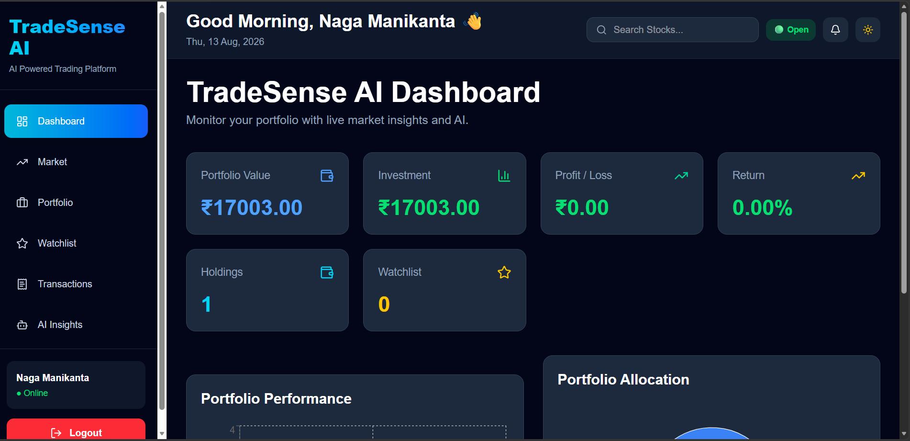
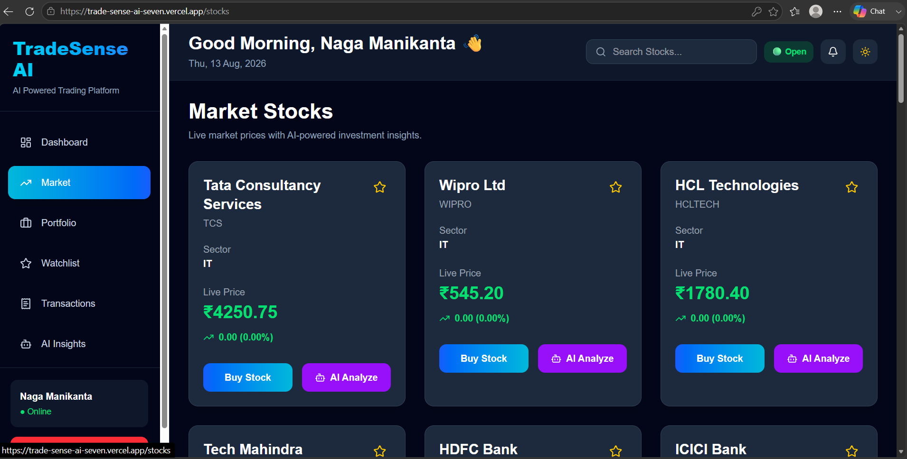
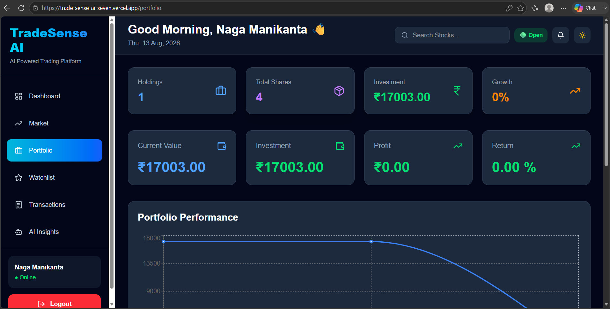
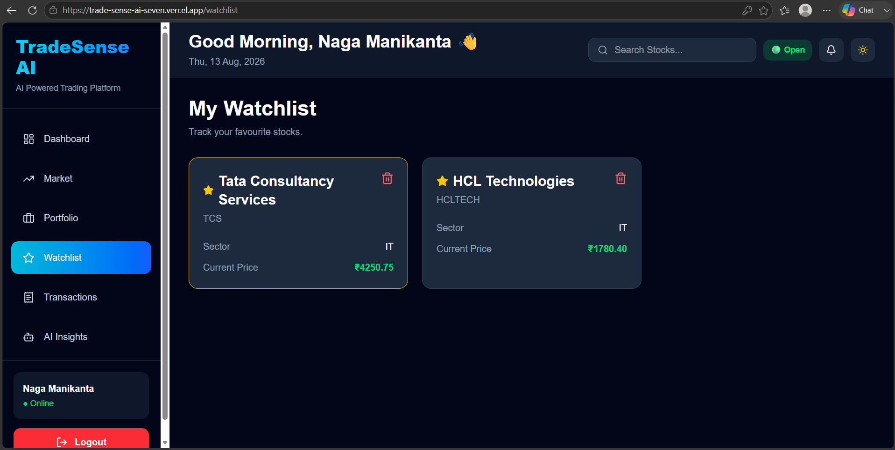
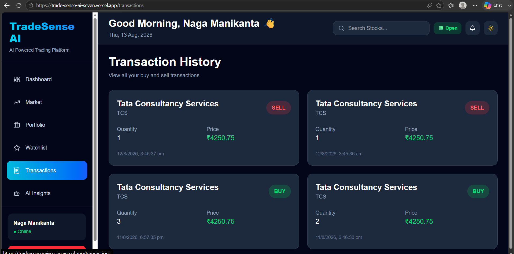
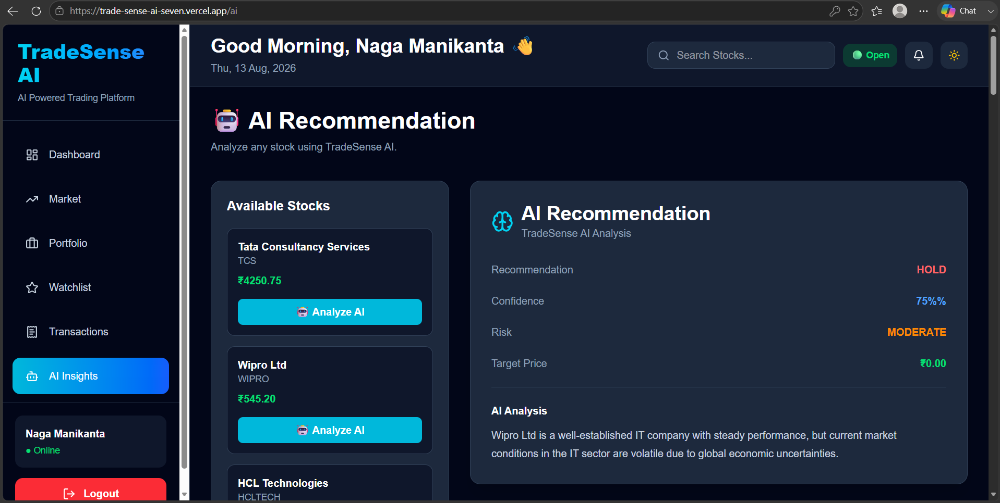

# 🚀 TradeSense AI

An AI-Powered Stock Trading and Portfolio Management Platform built using React, Spring Boot, and PostgreSQL.

## 🌐 Live Demo

### Frontend (Vercel)
https://trade-sense-ai-seven.vercel.app

### Backend API (Render)
https://tradesense-ai-backend-t1on.onrender.com

---

## 📌 Overview

TradeSense AI helps users manage their stock investments through a modern trading dashboard. Users can buy and sell stocks, track portfolios, manage watchlists, view transaction history, and receive AI-powered stock recommendations.

---

## 📸 Screenshots

### Dashboard



### Market



### Portfolio



### Watchlist



### Transactions



### AI Insights



## ✨ Features

### 🔐 Authentication
- User Registration
- User Login
- JWT Authentication
- Secure Session Management

### 📈 Market Dashboard
- Browse Available Stocks
- View Stock Information
- Modern Responsive UI

### 💰 Portfolio Management
- Buy Stocks
- Sell Stocks
- Track Investments
- Profit/Loss Analysis
- Portfolio Analytics

### ⭐ Watchlist
- Add Stocks to Watchlist
- Remove Stocks from Watchlist
- Track Favorite Stocks

### 📋 Transaction History
- Buy Transaction Records
- Sell Transaction Records
- Investment Tracking

### 🤖 AI Insights
- AI-Powered Stock Recommendations
- Risk Analysis
- Confidence Score
- Target Price Prediction
- Buy/Sell Suggestions

### 📱 Responsive Design
- Desktop Friendly
- Tablet Friendly
- Mobile Friendly

---

## 🛠 Tech Stack

### Frontend
- React.js
- Vite
- Tailwind CSS
- React Router DOM
- Axios
- Lucide React Icons

### Backend
- Java
- Spring Boot
- Spring Security
- Spring Data JPA
- Hibernate

### Database
- PostgreSQL

### Deployment
- Vercel (Frontend)
- Render (Backend)

---

## 📂 Project Structure

```text
TradeSense-AI
│
├── frontend
│   ├── src
│   ├── components
│   ├── pages
│   ├── services
│   └── layouts
│
├── backend
│   ├── controller
│   ├── service
│   ├── repository
│   ├── entity
│   ├── dto
│   └── security
│
└── README.md
```

---

## 🚀 Installation

### Clone Repository

```bash
git clone https://github.com/23r01a0595/TradeSense-AI.git
```

### Frontend Setup

```bash
cd frontend

npm install

npm run dev
```

### Backend Setup

```bash
cd backend

./mvnw spring-boot:run
```

---

## 🗄 Database

Database Used:

```text
PostgreSQL
```

Tables:

- Users
- Stocks
- Portfolio
- Watchlist
- Transactions

---

## 🎯 Key Highlights

- Full Stack Trading Platform
- AI Recommendation System
- JWT Authentication
- Responsive UI
- PostgreSQL Integration
- REST APIs
- Cloud Deployment
- Modern Dashboard Design

---

## 🔮 Future Enhancements

- Live Stock Market API Integration
- Real-Time Price Updates
- Advanced Portfolio Analytics
- AI Recommendation History
- Email Notifications
- Dark / Light Theme Toggle

---

## 👨‍💻 Author

### Naga Manikanta Kantamsetti

B.Tech Computer Science Engineering

CMR Institute of Technology

GitHub:
https://github.com/23r01a0595

Portfolio:
https://23r01a0595.github.io/portfolio/

---

## ⭐ Support

If you like this project, consider giving it a star on GitHub.
